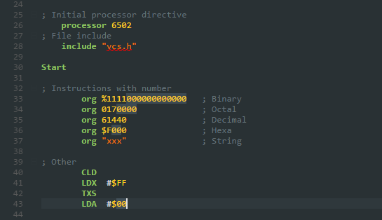
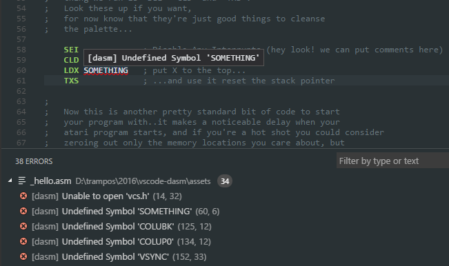

# Dasm macro assembler for VSCode

This is a dasm macro assembler [extension for Visual Studio Code](https://marketplace.visualstudio.com/items?itemName=zehfernando.vscode-dasm). It aims to provide the following in-editor features:

* Powerful assembly source editing for the 6502 (and others) using the [dasm macro assembler](http://dasm-dillon.sourceforge.net/)
* Assembling and exporting generated byte code (ROMs)
* Running Atari VCS 2600 code with full debugging and run-as-you-type abilities

**Notice, however, that this extension is a work-in-progress and that many features do not work yet.**

See more about the motivation for this extension in the [Why Atari?](WHY.md) document.

## Features

So far, the following features are supported:

### Basic syntax highlighting

### Real error checking as you type

<!--

* [TODO] Code editing
  * [TODO] .byte highlighting for pixels
  * [TODO] Syntax highlighting
  * [TODO] Source code snippets
  * [TODO] Smart bracket matching
  * [TODO] Parameter hints https://code.visualstudio.com/docs/editor/editingevolved#_parameter-hints
  * [TODO] Hovers
    * [TODO] Literals (showing values)
  * [TODO] Code completion proposals
  * [TODO] Code diagnostics
    * [TODO] Missing labels
    * [TODO] Missing literals
    * [TODO] Wrong processor types/other macro signatures
    * [TODO] Other general errors
  * [TODO] Go to definition
    * [TODO] Go to Symbol
    * [TODO] Open Symbol by name
    * [TODO] Peek
  * [TODO] Rename
  * [TODO] Folding
  * [TODO] Find all references of a symbol
  * [TODO] Highlight symbol occurences
  * [TODO] Show all symbols for quick navigation (@)
  * [TODO] Show all symbols in folder for quick navigation (#)
  * [TODO] Actions on errors/warnings
  * [TODO] CodeLens/Show actionable context information
  * [TODO] Rename symbols
  * [TODO] Block folding
  * [TODO] Format source
    * [TODO] Format selected lines
    * dasmlint?
    * [TODO] Format-as-you-type
* [TODO] Running
  * [TODO] Launch in separate Javatari tab
  * [TODO] Compile-as-you-type with debouncing
  * [TODO] Export ROM
  * [TODO] Debugging
    * [TODO] Step/Step-over/Step-into/step-out
    * [TODO] Breakpoints
    * [TODO] Reload/hot-reload?

-->

## More immediate TODO tasks

The next tasks in the roadmap are:

* [Language support for editor](https://code.visualstudio.com/docs/extensions/language-support)
  * More syntax highlight: symbol, labels
* [Language server](https://code.visualstudio.com/docs/extensions/example-language-server)
  * Hover support
  * Navigate to symbol, labels
  * Support incremental document sync
  * Resolve the include files problem
  * Auto completion
    * Add all registers, instructions
    * Add symbols
    * Add labels
* Play compiled game on Javatari tab
* Debugger support
  * Play/pause
  * Step in/out/etc
  * Hot reload (continue on same address)
  * Register/address monitoring
* Use [6502.ts](https://github.com/6502ts/6502.ts) instead of Javatari? Might not work at all (needs TIA, etc)

<!--
## Extension Settings

Include if your extension adds any VS Code settings through the `contributes.configuration` extension point.

For example:

This extension contributes the following settings:

* `myExtension.enable`: enable/disable this extension
* `myExtension.thing`: set to `blah` to do something
-->

## Release Notes

Check the [changelog](CHANGELOG.md) for a list of all released versions and their notes.

## Contributing

Bug reports, fixes, and other changes are welcomed. Our repository is [on GitHub](https://github.com/zeh/vscode-dasm).

## Acknowledgements

This extension uses the original [dasm macro assembler](http://dasm-dillon.sourceforge.net/) via [dasmjs](https://github.com/zeh/dasmjs), an [emscripten](https://github.com/kripken/emscripten)-compiled version of the original C code. This is ran on the background, as a language server tracked as [a separate repository](https://github.com/zeh/vscode-dasm-server).

It also uses [Javatari](https://github.com/ppeccin/javatari.js) to preview Atari-compatible ROMs.

And finally, this extension was heavily inspired by the [8bitworkshop](http://8bitworkshop.com/?platform=vcs&file=examples%2Fhello) web-based Atari development IDE (but shares no code with it except for its reliance on Javatari). One could say this extension is an attempt to create a similar Atari development experience, but within a dedicated standalone desktop application. [Buy their book](https://www.amazon.com/gp/product/1541021304/ref=as_li_qf_sp_asin_il_tl?ie=UTF8&tag=pzp-20&camp=1789&creative=9325&linkCode=as2&creativeASIN=B01N4DSRIZ&linkId=04d39e274c06e6c93b93d20a9a977111) to show your support.

## License

This follows dasm itself and uses the [GNU Public License v2.0](https://www.gnu.org/licenses/old-licenses/gpl-2.0.en.html).
